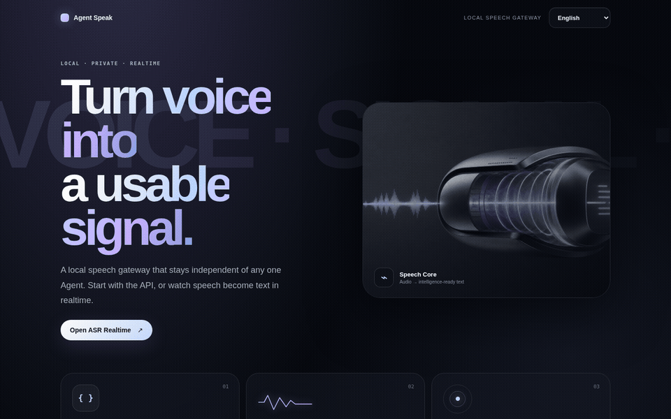
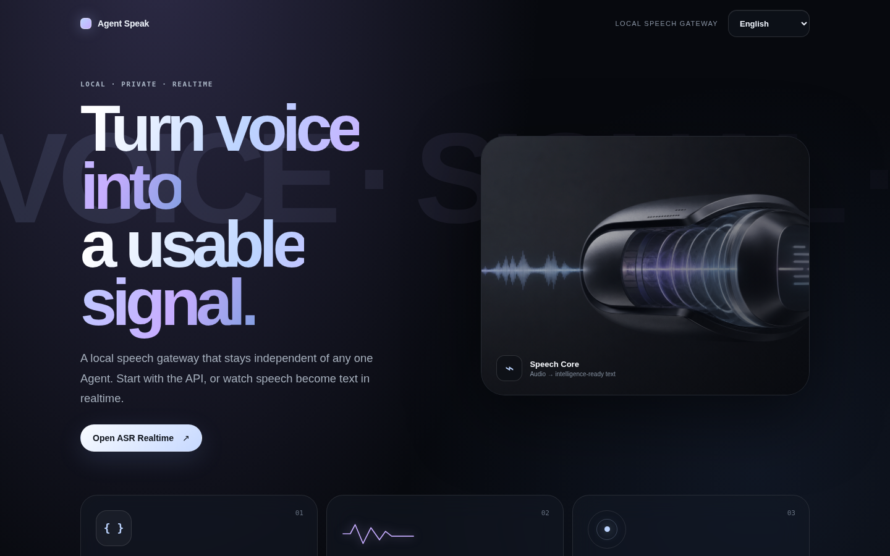
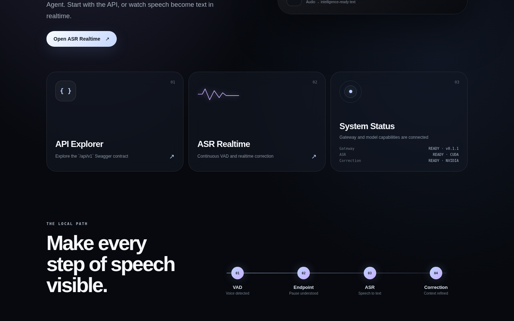
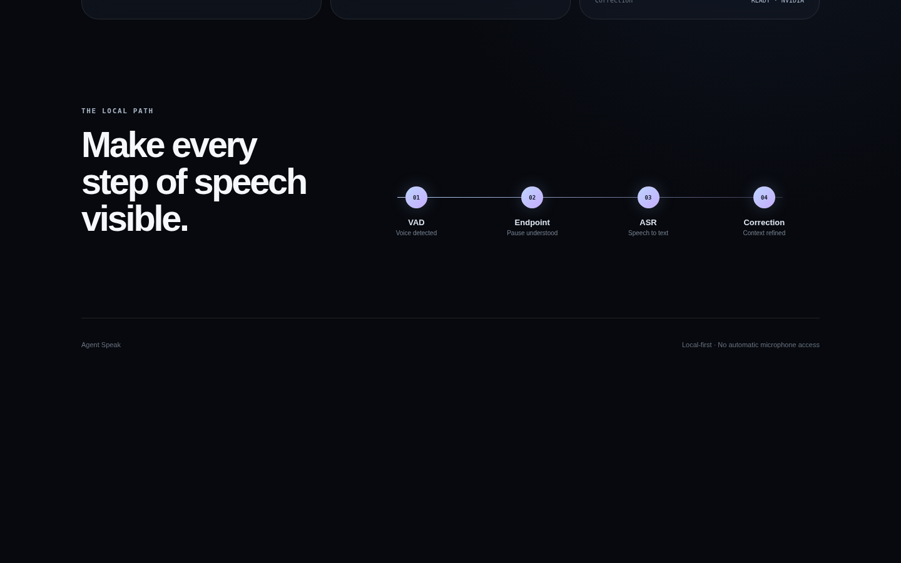
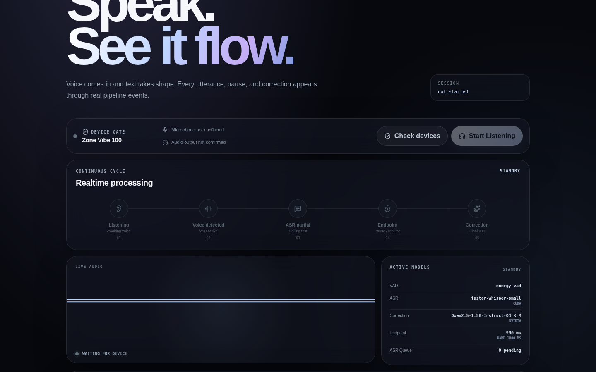
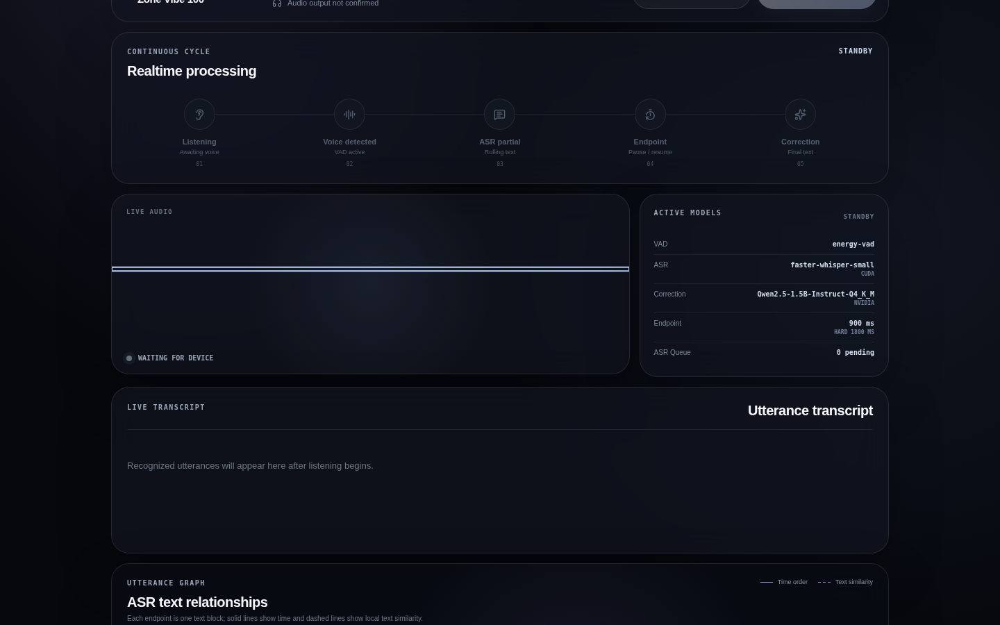
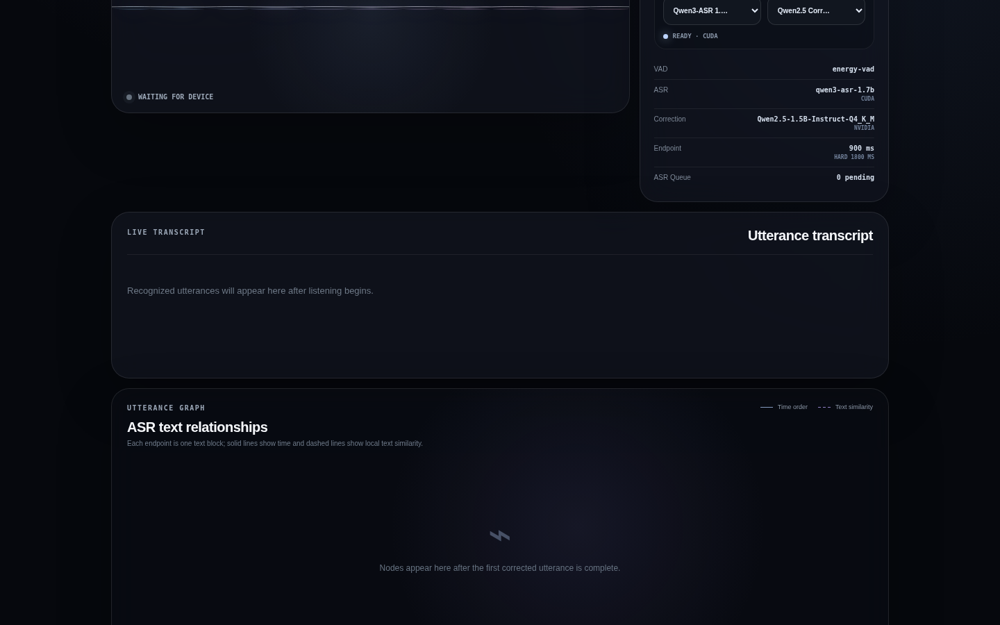
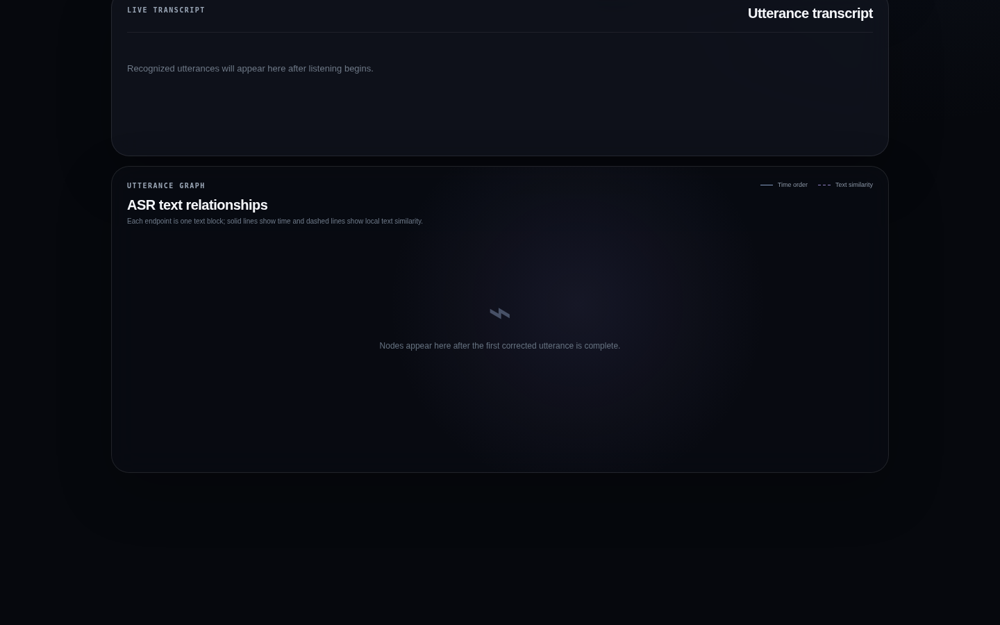
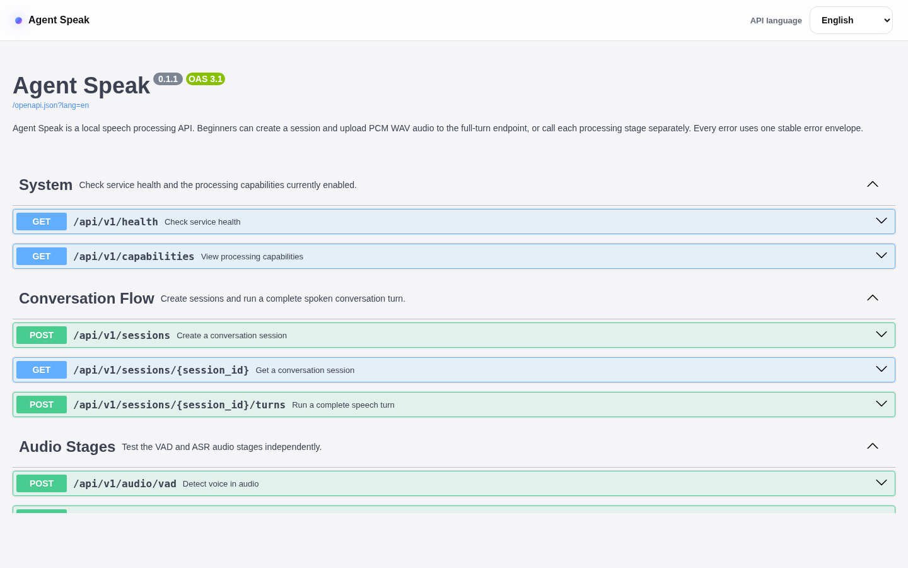

# Agent Speak

English | [繁體中文](README.zh-TW.md)

Agent Speak is a Docker-first voice gateway that gives an external AI agent ears and a voice without locking the runtime to one LLM. Hermes, Codex, OpenClaw, Ollama-based agents, and other MCP-capable hosts can use the same bounded voice pipeline:

`microphone → VAD → selectable local ASR → external agent → Piper TTS → speaker`

The gateway exposes REST, WebSocket events, a four-language WebUI, fully localized OpenAPI documentation, and a stdio MCP control plane. English is the default; the top-right selector switches English, Traditional Chinese, Japanese, and Korean across the project portal, Realtime Studio, and Swagger. The built-in Agent stage remains a transparent development echo; real reasoning belongs to the connected external agent.

## Product tour

The animated carousel walks through the English UI without requesting microphone permission or starting audio capture.

[](docs/screenshots/agent-speak-tour.gif)

<table>
  <tr>
    <td width="50%"><a href="docs/screenshots/01-project-home-hero.png"></a><br><sub>Project portal · product story and language selector</sub></td>
    <td width="50%"><a href="docs/screenshots/02-project-home-destinations.png"></a><br><sub>Destinations · API, realtime demo, and live system state</sub></td>
  </tr>
  <tr>
    <td width="50%"><a href="docs/screenshots/03-project-home-pipeline.png"></a><br><sub>Pipeline overview · VAD → Endpoint → ASR → Correction</sub></td>
    <td width="50%"><a href="docs/screenshots/04-asr-realtime-device-gate.png"></a><br><sub>Device gate · input and output must be visible before listening</sub></td>
  </tr>
  <tr>
    <td width="50%"><a href="docs/screenshots/05-asr-realtime-process-cycle.png"></a><br><sub>Process cycle · semantic stages with visual afterglow</sub></td>
    <td width="50%"><a href="docs/screenshots/06-asr-realtime-transcript.png"></a><br><sub>Live transcript · partial, endpoint, and corrected utterances</sub></td>
  </tr>
  <tr>
    <td width="50%"><a href="docs/screenshots/07-asr-realtime-utterance-graph.png"></a><br><sub>Utterance graph · time order and local text similarity</sub></td>
    <td width="50%"><a href="docs/screenshots/08-api-explorer.png"></a><br><sub>API Explorer · localized operations, parameters, and schemas</sub></td>
  </tr>
</table>

## Quick start

Requirements: Linux, Docker Engine with Compose v2, `/dev/snd`, and network access for the first model download.

```sh
git clone https://github.com/a0665x/Agent_Speak.git
cd Agent_Speak
./run.sh --models
./run.sh --build
```

Project portal: http://127.0.0.1:8765/?lang=en

OpenAPI: http://127.0.0.1:8765/docs?lang=en

Realtime Studio: http://127.0.0.1:8765/asr_realtime?lang=en

`/asr_realtime` is continuous transcription only: it does not call the Agent stage, TTS, Codex injection, or speaker playback. The legacy `/realtime` path redirects there for compatibility. The browser enables Start only after an explicit check can see the current system-default input and output endpoints (with a first-labeled-device fallback); output visibility is not proof of physical playback. Raw PCM16 travels over the realtime WebSocket, while MCP remains a low-frequency control plane.

Choose English, Traditional Chinese, Japanese, or Korean from any top-right presentation-language selector. The selection persists and follows navigation links. Swagger localizes endpoint titles, descriptions, parameters, request fields, and response fields while keeping paths and payload identifiers unchanged.

Realtime Studio has independent **Speech language**, **ASR model**, and **Correction model** selectors. Speech language supports Auto detect, English, 繁體中文, 日本語, and 한국어; until explicitly changed, it follows the presentation language. The ASR choices are Qwen3-ASR 1.7B (default), Breeze-ASR-25, and Faster Whisper Small. Correction is Qwen2.5 Correction or Disabled / Raw ASR. Every selection is frozen into the newly created session. Changing a model requires no Submit button: the UI safely stops an active stream, activates one resident ASR model, creates a new frozen session, and resumes only if the audio device gate remains ready. Completed transcript and graph data stay visible; unfinished partial text is discarded. TTS voice selection remains separate.

VAD produces rolling partial text, so the current words may change. Qwen correction may revise the previous sentence together with the current sentence; older sentences lock. A silence candidate starts at 900 ms and may extend to the 1,800 ms hard endpoint. Invalid, late, or excessive Qwen edits fall back to final ASR text. The client does not reconnect automatically. CPU mode is functional, while realtime latency and GPU gains depend on the host.

`./run.sh --models` explicitly and idempotently downloads all pinned inference artifacts after an 8 GiB free-space reserve check. The download is atomic, verifies exact revisions and required files, excludes training checkpoints, and leaves cached models untouched. Expect roughly 10 GiB of model data plus temporary download overhead. Normal `--build` and `--up` are verify-only and never begin a multi-gigabyte download. Compose maps `/dev/snd` by default and persists private state in ignored `data/`, `runtime/`, and `models/` directories.

## Verify the installation

```sh
./run.sh --status
./scripts/health_smoke.sh
./scripts/smoke_api.sh
./run.sh --test
```

`--status` checks container health plus real ALSA capture/playback discovery. The two smoke scripts automatically run inside the active Gateway container, so a Docker installation does not need a host Python environment: `health_smoke.sh` verifies health and writable storage, while `smoke_api.sh` exercises session creation, WebSocket events, a complete ASR/TTS turn, WAV artifact retrieval, and the speaker-profile lifecycle. `--test` runs the full isolated suite without production data mounts, network access, or `/dev/snd`.

Expected success markers include `STATUS_HEALTHY`, `HEALTH_SMOKE_OK mode=docker`, `API_SMOKE_OK mode=docker`, and `TESTS_OK`.

## One operator command

```text
./run.sh --build      Build and start
./run.sh --up         Start
./run.sh --down       Stop; preserve data and models
./run.sh --down_up    Recreate the stack
./run.sh --restart    Same as --down_up
./run.sh --rebuild    No-cache rebuild and start
./run.sh --models     Download and verify all pinned inference models
./run.sh --status     Container, API, and audio status
./run.sh --logs       Latest gateway logs
./run.sh --test       Full test suite in Docker
./run.sh --help       Command reference
```

Optional settings can be placed in an untracked `.env`; see [.env.example](.env.example). The default host publication is `127.0.0.1`, not a public interface. Persistent host paths can be changed with `AGENT_SPEAK_DATA_PATH`, `AGENT_SPEAK_RUNTIME_PATH`, and `AGENT_SPEAK_MODELS_PATH`.

`AGENT_SPEAK_ACCELERATOR=auto` is the default. It selects the separate NVIDIA image only when `nvidia-smi` and Docker's NVIDIA runtime are both ready; otherwise it prints the reason and starts the CPU image. Use `cpu` to force the portable CPU/INT8 path or `nvidia` to require CUDA and fail instead of falling back. NVIDIA mode requires the NVIDIA Container Toolkit and builds `agent-speak:gpu-local` with CUDA 12 and cuDNN 9. `./run.sh --status` reports both the selected Compose accelerator and the ASR provider's actual device.

## Connect an external Agent through MCP

Point a stdio MCP host at the repository's absolute script path:

```json
{
  "command": "/absolute/path/to/Agent_Speak/scripts/run_mcp.sh",
  "args": [],
  "env": {
    "AGENT_SPEAK_URL": "http://127.0.0.1:8765"
  }
}
```

The script attaches the MCP process to the running gateway container. Available tools:

- `status` and `capabilities`
- `list_audio_devices`
- `microphone_smoke`
- `listen_once`
- `speak`

The safe interaction loop is:

1. Inspect `status`, capabilities, and audio devices.
2. With explicit user consent, call `listen_once`.
3. Let the external agent reason and use its own tools, memory, and skills.
4. Show the answer as text.
5. With playback consent, call `speak`; only `played=true` proves physical playback.

Install the portable Skill in a compatible host or ask the agent to read [AGENTS.md](AGENTS.md) and [skills/agent-speak/SKILL.md](skills/agent-speak/SKILL.md). The MCP architecture and host contract are defined in [spec/SKILL_AND_MCP.md](spec/SKILL_AND_MCP.md).

## Interfaces

- WebUI: English, Traditional Chinese, Japanese, and Korean recording, upload, pipeline timeline, results, and speaker profiles
- REST/OpenAPI: bounded PCM WAV stages, complete turns, and fully localized operation/parameter/response documentation
- WebSocket: ordered session events
- stdio MCP: low-frequency control; raw realtime audio does not travel through JSON-RPC

Traditional Chinese OpenAPI guide: [docs/OPENAPI_QUICKSTART_ZH_TW.md](docs/OPENAPI_QUICKSTART_ZH_TW.md)

## Hardware and security

- `/dev/snd` is mapped into the gateway container by default for ALSA capture and playback.
- NVIDIA acceleration is optional. Hosts without a supported NVIDIA Docker runtime continue on CPU in `auto` mode.
- Microphone and physical playback tools require explicit per-call user consent.
- The service has no public-network authentication. Keep the default loopback binding or place it behind a trusted private HTTPS layer.
- Speaker matching is convenience identification, not authentication.
- Recordings, generated audio, speaker features, databases, models, credentials, private keys, local Agent state, and caches are excluded from Git and Docker build context.
- `./run.sh --test` uses a separate no-network container without production mounts or `/dev/snd`.

Architecture, runtime, tests, and project state start at [spec/PROJECT_MAP.md](spec/PROJECT_MAP.md).
